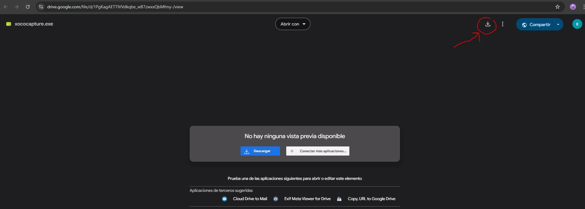
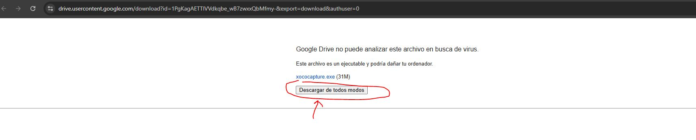

# Xocohistoria ( clipboard Manager )

Xocohistoria es una aplicación desarrollada en Python que permite gestionar y organizar el historial del portapapeles, almacenar favoritos y facilitar el arrastre de imágenes y texto.

## Características
- **Historial del portapapeles:** Guarda automáticamente texto e imágenes copiados.
- **Favoritos:** Permite almacenar elementos importantes del portapapeles.
- **Arrastrar y soltar:** Facilita mover imágenes y texto entre aplicaciones.
- **Modo Claro/Oscuro:** Alterna entre estilos visuales.
- **Copiado y pegado rápido:** Usa atajos de teclado para copiar elementos directamente desde el historial.
- **Guardar y cargar favoritos:** Guarda tus favoritos en archivos JSON y recárgalos cuando lo necesites.
- **Ventana de favoritos separada:** Mantén tus elementos importantes siempre visibles.

## Instalación y Ejecución
 Descarga el ejecutable desde el siguiente enlace:
   [Descargar Clipboard Manager](https://drive.google.com/file/d/1Gn51XQqtvHl5q9_2TJWYGmyJnxgY2jji/view?usp=sharing)
   
### Video de demostración
[Ver video de demostración]([https://www.youtube.com/watch?v=i-6FQpiGJdk&t=2s](https://www.youtube.com/watch?v=nRVUxPljAbw))   

## Uso
- **Copiar elemento:** Ctrl + C (elemento seleccionado en el historial)
- **Abrir favoritos:** Menú → Favoritos → Abrir Favoritos
- **Alternar modo claro/oscuro:** Menú → Vista → Modo Claro / Modo Oscuro
- **Guardar favoritos:** Menú → Favoritos → Guardar Favoritos
- **Cargar favoritos:** Menú → Favoritos → Cargar Favoritos
- **Arrastrar elemento:** Haz clic y arrastra desde el historial o favoritos a otras aplicaciones.

## Capturas de pantalla instalación

## Contribuciones
Las contribuciones son bienvenidas. Realiza un fork del repositorio y envía tus pull requests.

---

_Disfruta de Clipboard Manager y facilita tu flujo de trabajo con un portapapeles mejorado!_
